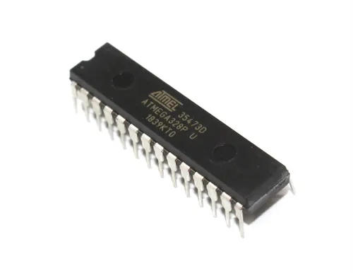
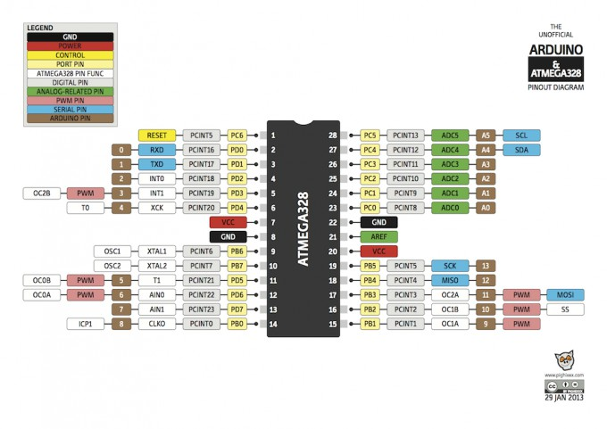

# **Arduino UNO**
 
Arduino Uno é uma placa microcontrolada baseada no ATmega328P ( ficha técnica ). Possui 14 pinos de entrada / saída digital (dos quais 6 podem ser usados ​​como saídas PWM), 6 entradas analógicas, um ressonador de cerâmica de 16 MHz (CSTCE16M0V53-R0), uma conexão USB, um conector de alimentação, um conector ICSP e um botão de reinicialização . Ele contém tudo o que é necessário para dar suporte ao microcontrolador; simplesmente conecte-o a um computador com um cabo USB ou ligue-o com um adaptador AC-DC ou bateria para começar. Você pode mexer no seu Uno sem se preocupar muito em fazer algo errado; na pior das hipóteses, você pode substituir o chip por alguns dólares e começar de novo.

"Uno" significa um em italiano e foi escolhido para marcar o lançamento do Arduino Software (IDE) 1.0. A placa Uno e a versão 1.0 do Arduino Software (IDE) eram as versões de referência do Arduino, agora evoluídas para versões mais recentes. A placa Uno é a primeira de uma série de placas Arduino USB e o modelo de referência para a plataforma Arduino; para uma lista extensa de placas atuais, passadas ou desatualizadas, consulte o índice de placas do Arduino.
  
    
    
 ## _Microcontrolador atmega328p_

  
 
   
## _Esquema de pinagem do Microcontrolador_

 
<h2> Começando </h2>

A página [Getting Started with Arduino Uno](https://www.arduino.cc/en/Guide/ArduinoUno) contém todas as informações de que você precisa para configurar sua placa, [usar o software Arduino (IDE)](https://www.arduino.cc/en/software) e começar a mexer na codificação e na eletrônica. 

Na seção [Tutoriais](https://www.arduino.cc/en/Tutorial/HomePage), você pode encontrar exemplos de bibliotecas e esboços integrados, bem como outras informações úteis para expandir seu conhecimento sobre o hardware e software Arduino. Encontre inspiração para seus projetos do Uno em nossa plataforma de tutoriais [Project Hub](https://create.arduino.cc/projecthub?by=part&part_id=8233&sort=popular).

 
<h2> Preciso de ajuda?</h2>

Verifique o Fórum do Arduino para perguntas sobre a [linguagem](https://forum.arduino.cc/index.php?board=4.0) do [Arduino](https://forum.arduino.cc/index.php?board=4.0) ou como fazer seus próprios [projetos com o Arduino](https://forum.arduino.cc/index.php?board=3.0) . Se precisar de ajuda com sua placa, entre em contato com o Suporte ao usuário oficial do Arduino conforme explicado em nossa página de [contato](https://support.arduino.cc/hc/en-us) .

fonte: [arduino.cc](https://www.arduino.cc/)

